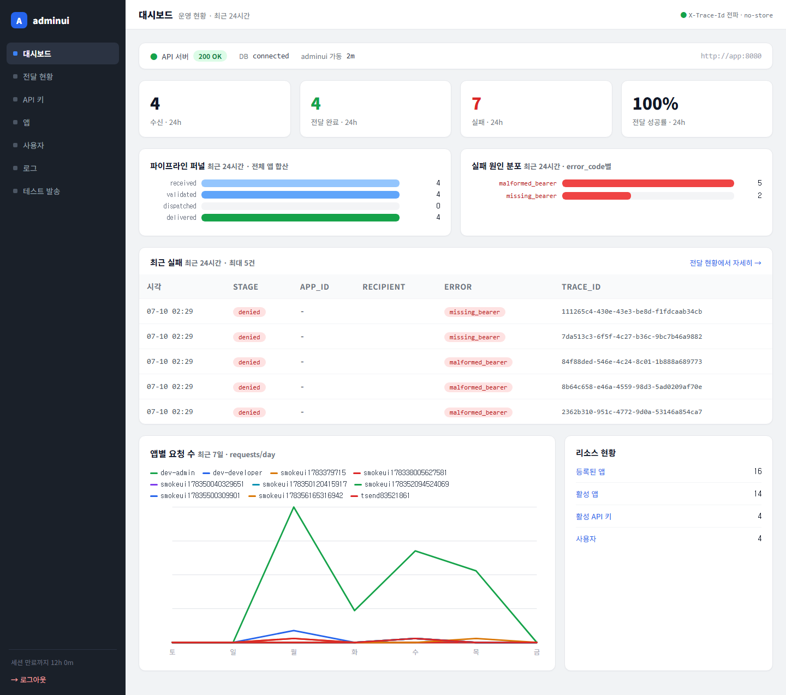
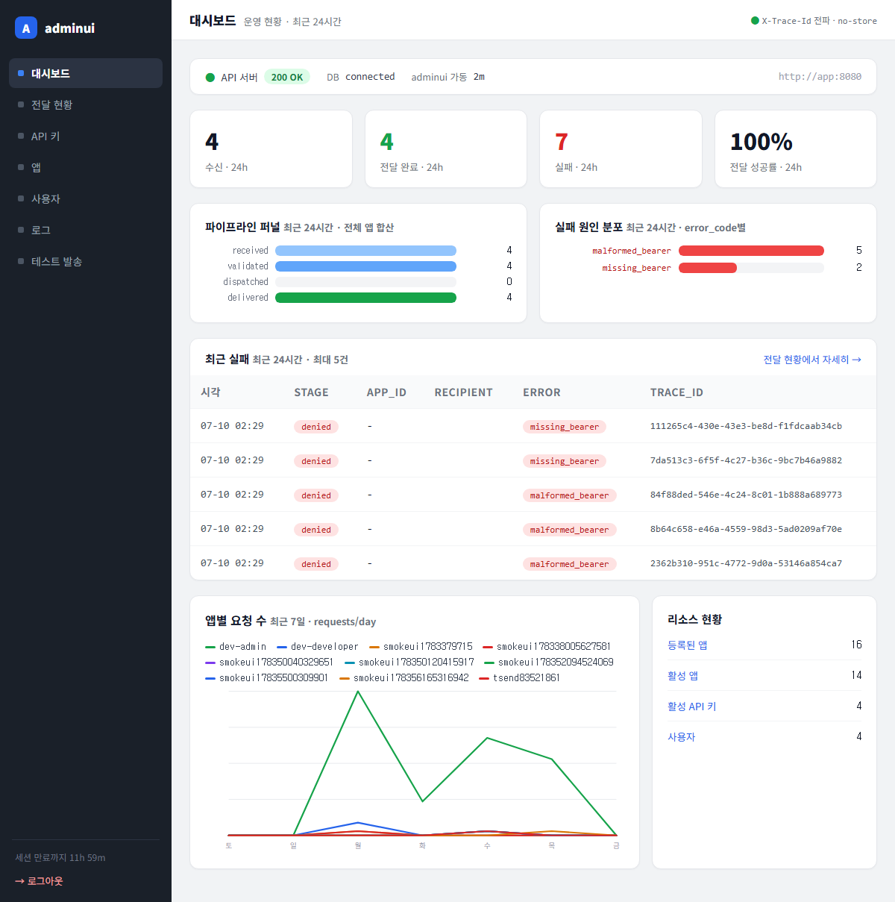
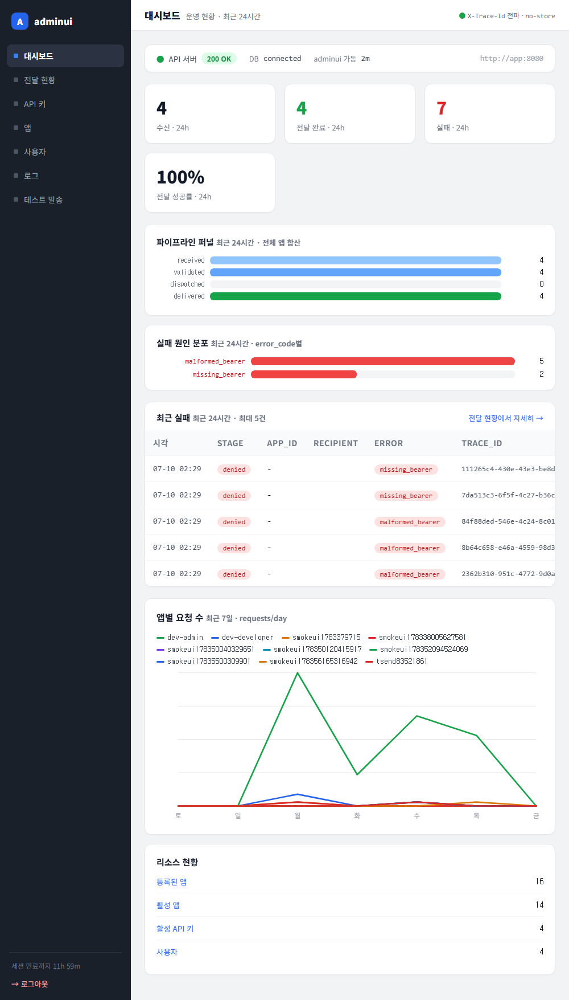

# 테스트 보고서 — 대시보드 시각화(파이프라인 퍼널 + 실패 원인 분포)

- **날짜:** 2026-07-10
- **대상 변경:** `d42a241` — feat(adminui): 대시보드 파이프라인 퍼널 + 실패 원인 분포 시각화 추가
- **범위:** `internal/adminui` 6파일 — 스토어 2쿼리(`PipelineStageCounts`·`FailureCauseCounts`), 뷰/빌더(`buildPipelineFunnel`·`buildFailureCauses`·`barWidthPct`), 대시보드 템플릿 진단 행(diag-grid), CSS, 테스트(fake + 유닛/렌더).

---

## 1. 컨테이너 검증 (go build / vet / test)

```
MSYS_NO_PATHCONV=1 docker run --rm -v .../telegram_server:/src ... golang:1.26 \
  sh -c "go build ./... && go vet ./internal/adminui/... && go test ./internal/adminui/..."
```

결과: **green** — `ok github.com/CatPope/telegram_server/internal/adminui`.

신규/영향 테스트:

| 테스트 | 커버 | 결과 |
|--------|------|------|
| `TestBuildPipelineFunnel` | 빈 입력 nil, 입력 순서 무관 stage 정렬, 누락 stage=0 바 | PASS |
| `TestBuildFailureCauses` | 빈 입력 nil, 최대=100%, sliver 2% 바닥, 순위 유지 | PASS |
| `TestDashboardRendersFunnelAndCauses` | 두 카드 실데이터 렌더 | PASS |
| `TestDashboardFunnelAndCausesDegradeIndependently` | 쿼리 에러 → 배너, KPI 무영향(독립 degrade) | PASS |
| `TestDashboardEmptyFunnelAndCausesShowNotes` | 빈 윈도 → 안내 문구, 막대 미렌더 | PASS |

첫 실행에서 2건 실패 → 즉시 수정:
- `TestBuildFailureCauses`: 테스트 산수 오류(1/8=12.5%로 2% 바닥 미적용) → max=100·sliver=1로 데이터 교정.
- `TestDashboardKPIErrorDoesNotRenderZeros`(기존): 실패-원인 카드의 빈 문구 "✓ 최근 24시간 실패 없음"이 기존 테스트가 금지한 `"실패 없음"` 부분문자열과 충돌 → 빈 문구를 평범한 캡션으로 변경(동작은 정상, 문구만 겹침).
재실행 후 전부 PASS.

## 2. 시각 검증 (Playwright) — 스크린샷 첨부

adminui 이미지 재빌드 후(`embed.FS`라 재기동만으론 미반영), diag-grid 반응형 분기점(`@media max-width:1100px`)을 가로지르는 3폭에서 대시보드 fullPage 촬영. 두 카드 모두 실데이터로 채운 상태.

### 1440px — 2열

*퍼널(received/validated/dispatched/delivered = 4/4/0/4, dispatched 0 빈 바 정상)과 실패 원인(malformed_bearer 5 · missing_bearer 2 순위 막대)이 2열로 균형. 오버플로·붕괴 없음.*

### 1200px — 2열 유지

*분기점 바로 위. 2열 유지, 카드 균형, 긴 error_code 라벨 밀림 없음.*

### 1000px — 1열 붕괴

*분기점 아래. diag-grid가 단일 열로 접혀 퍼널·실패원인이 세로 적층, 막대 정상, 깨짐 없음. 하단 chart-grid도 동일하게 접힘.*

## 3. 데이터 조건

- 24h 윈도 실데이터. 퍼널: received/validated/delivered 각 4(dispatched 0).
- 실패 원인: 잘못된/누락 베어러로 `POST /v1/messages/direct`(app:18080) 요청을 보내 정상 writer 경로로 `denied` 감사 행 생성 — malformed_bearer 5, missing_bearer 2. **raw INSERT 미사용, 감사 해시 체인 무결.**

## 4. 결과 / 미결

- **결과: green.** 컨테이너 검증 PASS, 3폭 시각 검증 깨짐 없음, 코드 리뷰(oh-my-claudecode:code-reviewer) 0 결함 APPROVE.
- 참고(정상 동작): KPI가 "실패 24h=7 / 성공률 100%"로 보일 수 있음 — 베어러 단계 거부는 received 이전이라 파이프라인에 진입하지 않음(delivered/received=4/4=100%). 실패-원인 카드가 이 7건의 내역을 설명하는 구조.
- 후속: ③ 라인차트 개선(7일 앱별 → 시간대별/상위 N), ④ 전달 지연 p50/p95(경계·모집단 처리 포함) — 별도 사이클.
