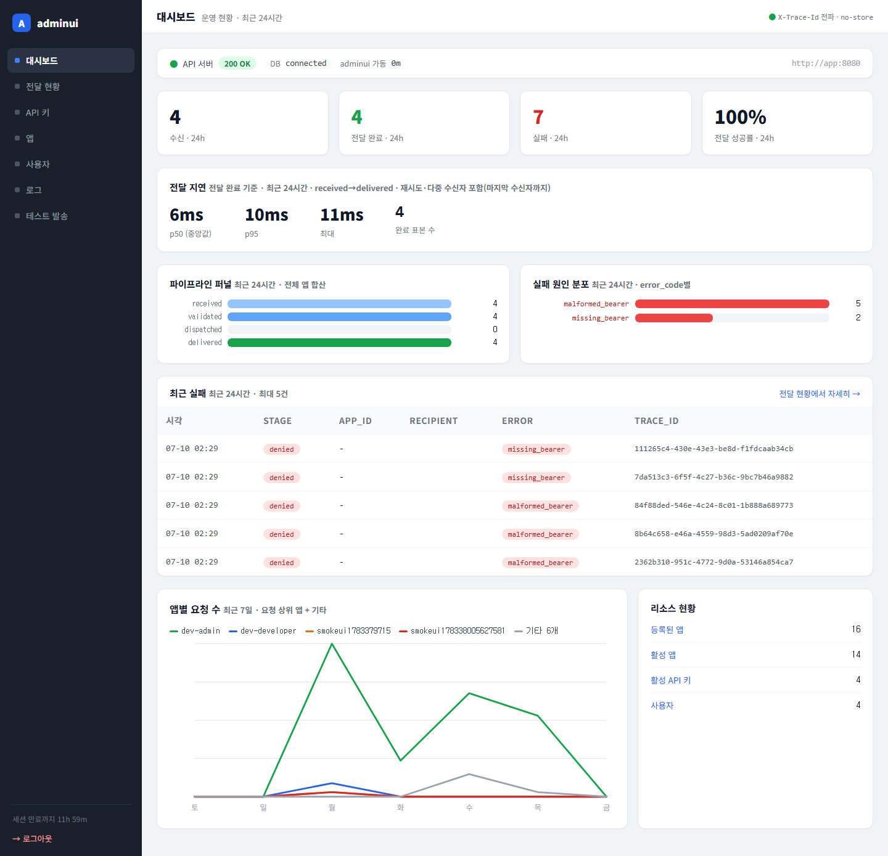
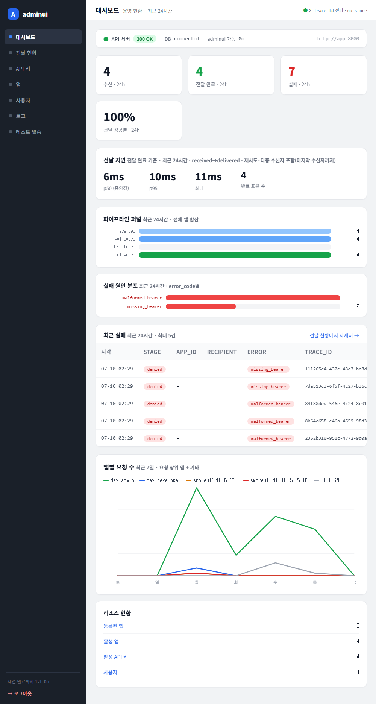

# 테스트 보고서 — 전달 지연 p50/p95 카드

- **날짜:** 2026-07-10
- **대상 변경:** 대시보드 "전달 지연" 카드 — received→delivered 종단 지연 백분위 (④)
- **범위:** `internal/adminui/store.go`(`DeliveryLatency` 쿼리 + `LatencyStats`), `dashboard.go`(`LatencyView`·`formatLatency`·`buildLatencyView` + 핸들러 배선), `dashboard_test.go`·`apps_test.go`(테스트/fake), `templates/dashboard.html`(카드), `templates/base.html`(CSS).

---

## 1. 컨테이너 검증 (go build / vet / test)

```
... golang:1.26 sh -c "go build ./... && go vet ./internal/adminui/... && go test ./internal/adminui/..."
```

결과: **green** — `ok github.com/CatPope/telegram_server/internal/adminui`.

| 테스트 | 커버 | 결과 |
|--------|------|------|
| `TestFormatLatency` | ms/s/m 포맷 경계(0/sub-s/반올림/1s/60s/분) | PASS |
| `TestBuildLatencyView` | Count 0 → nil, 포맷 매핑 | PASS |
| `TestDashboardRendersLatency` | 카드 렌더(라벨·수치) | PASS |
| `TestDashboardLatencyDegradesAndEmpty` | 에러 → 배너·카드 미렌더, 빈 윈도 → 카드 미렌더(거짓 0ms 금지) | PASS |

## 2. 라이브 쿼리 검증 (실 postgres)

CTE + `percentile_cont`가 실제 DB에서 실행되는지 확인(단위 테스트는 fake라 SQL 미검증). 스토어와 동일한 쿼리를 psql로 실행:

```
count | p50        | p95        | max
    4 | 0.0057105  | 0.01022... | 0.011009
```

→ 24h 완료 4건, p50≈5.7ms · p95≈10.2ms · max≈11ms. 대시보드 카드 표기(6ms/10ms/11ms)와 일치(반올림).

## 3. 시각 검증 (Playwright) — 스크린샷 첨부

### 1440px

*KPI 행 바로 아래 "전달 지연 · 전달 완료 기준 · 최근 24시간 · received→delivered(재시도 포함)" 카드. p50 6ms / p95 10ms / max 11ms / 완료 표본 4가 한 줄. 대시보드 서사: 생존→흐름→**지연**→막힘/실패→최근실패→추세→리소스.*

### 1000px

*최소폭에서도 4개 수치가 한 줄에 여유롭게, 카드 full-width 렌더, 깨짐 없음.*

## 4. 정확성 처리 (비용 아닌 설계 결정)

검증 단계에서 합의한 함정들을 쿼리로 흡수:
- **윈도 경계 페어링:** delivered는 24h 윈도로 앵커, received는 25h(1h slack)까지 소급 조인 → 윈도 직전 received·윈도 내 delivered 쌍을 놓치지 않음(릴레이 지연이 1h 미만이라 충분, 무한 소급 스캔 회피로 양쪽 인덱스 유지).
- **모집단:** delivered 있는 trace만 → "전달 완료 기준"으로 라벨. 진행중/실패는 delivered 부재로 제외(성공 표본, KPI 카운트와 분모 다름을 캡션에 명시).
- **재시도 의미:** min(received)→max(delivered) = 재시도 포함 종단 시간.
- **음수 방지:** `delivered_at >= received_at`로 시계 왜곡 음수 쌍 배제.
- **빈 윈도:** COALESCE로 count=0·백분위 0 반환 → `buildLatencyView`가 nil → 카드 대신 미표시(거짓 0ms 금지).

## 5. 리뷰 반영 (code-reviewer APPROVE, CRITICAL/HIGH 0)

리뷰 지적 3건을 커밋 전 반영:
- **[MEDIUM] 빈 상태 가시화:** 완료 0건일 때 카드가 사라져 "완료 없음"과 "기능 부재"를 구분 못 하던 문제 → "최근 24시간 완료된 전달이 없습니다" 안내 문구 추가(테스트로 고정).
- **[LOW] 캡션 정확화:** 다중 delivered 행의 출처는 재시도가 아니라 다중 수신자 fan-out → 주석·캡션을 "재시도·다중 수신자 포함(마지막 수신자까지)"로 수정.
- **[LOW] formatLatency 경계:** 0.9996s→"1000ms", 59.96s→"60.0s" 반올림 아티팩트 → 밴드별 반올림 후 임계 비교로 수정(경계 테스트 추가).

## 6. 결과 / 미결

- **결과: green.** 컨테이너 검증 PASS(포맷 경계 테스트 포함), 라이브 쿼리 정상, 2폭 시각 검증 깨짐 없음, 리뷰 3건 반영 후 재검증 PASS.
- 대시보드 시각화 로드맵 ①②③④ 완료.
