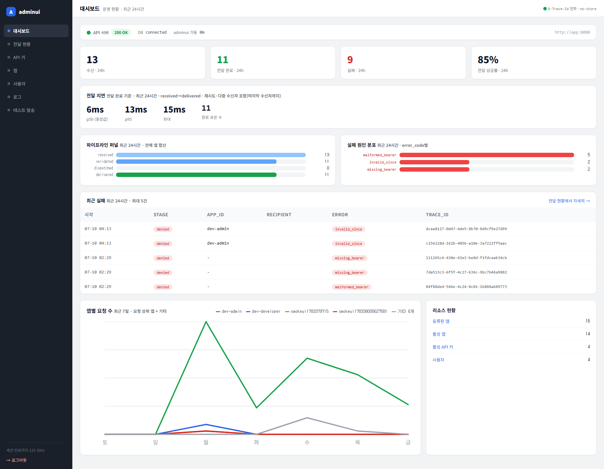
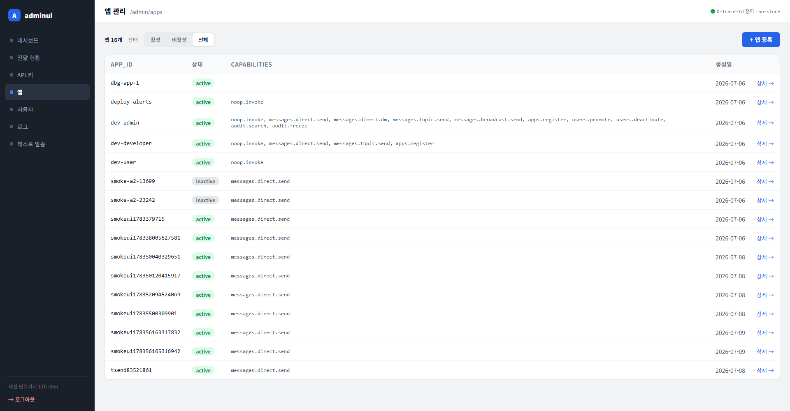
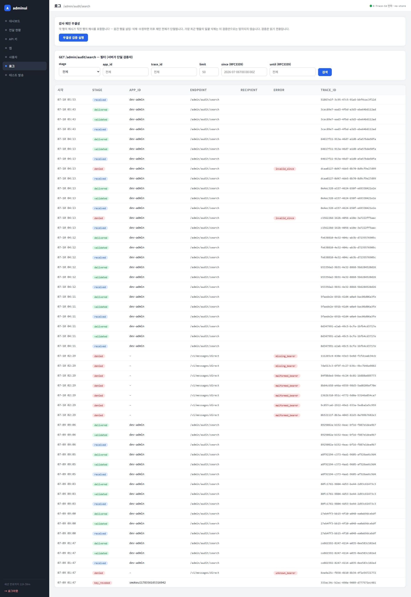
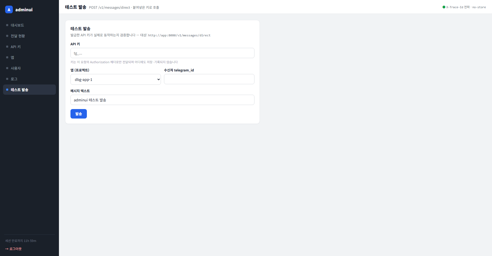

# 테스트 보고서 — 전 페이지 full-width 전환

- **날짜:** 2026-07-10
- **대상 변경:** `.content`의 `max-width: 1280px` 캡 제거 → 인증 페이지가 가용 폭(사이드바 제외)을 모두 사용
- **범위:** `internal/adminui/templates/base.html`(CSS 1줄)

---

## 1. 결정 — "별도의 이유가 없다면 full-width"

`.content { max-width: 1280px }` 하나가 모든 인증 페이지 폭을 묶고 있었다. 이를 제거해 목록/테이블/대시보드가 화면을 꽉 채운다. 단 **폼은 예외로 남긴다** — 입력 폼을 1900px로 늘리면 오히려 판독·조작이 나빠지므로("별도의 이유"), 다음 카드들의 개별 `max-width`는 유지:

| 페이지 | 폼 카드 max-width | 유지 이유 |
|--------|-------------------|-----------|
| test-send | 760px | 키/수신자/텍스트 입력 폼 |
| app 생성/수정 | 600 / 680px | 등록·capability 편집 폼 |
| 키 발급 결과 | 680px | 평문 키 1회 표시 |
| users(DB 미연결 fallback) | 520px | 직접 입력 폼 |

모달 `.dialog`·로그인 `.login-card`의 max-width도 의도된 제약이라 유지.

## 2. 컨테이너 검증

`go test ./internal/adminui/`(렌더 테스트가 템플릿 파싱 검증) → **green**. CSS 변경이라 Go 로직 영향 없음.

## 3. 시각 검증 (Playwright · 1920px) — 스크린샷 첨부

**인증 7개 페이지 전부** 1920px full-page 촬영·판독. 목록/테이블/대시보드 full-width 전환, 깨짐 0. 대표 4장:

### 대시보드 (그리드)

*KPI 4카드 균등 분산, diag-grid 2열이 넓어져 실패 원인 막대가 더 선명, 라인차트 확대로 판독성 향상. 깨짐 없음.*

### 앱 목록 (테이블)

*테이블 full-width, dev-admin의 긴 capabilities가 한 줄에 여유롭게, 생성일·상세가 우측 정렬.*

### 로그 (최다 컬럼 테이블)

*7컬럼(시각·STAGE·APP_ID·ENDPOINT·RECIPIENT·ERROR·TRACE_ID)이 고르게 퍼짐. 필터 카드도 full-width.*

### 테스트 발송 (폼 — 의도된 예외)

*폼 카드는 760px 읽기 폭 유지 — full-width로 늘리지 않음(입력 UX 보호).*

나머지 3개도 동일 확인: **delivery**(앱별 퍼널 바가 full-width로 길어져 선명 + 최근 실패 테이블 6컬럼 분산), **keys**(키 테이블 full-width), **users**(목록 테이블 full-width, 인라인 편집 패널 정상).

## 4. 결과 / 미결

- **결과: green.** 7개 페이지 1920px 실측 깨짐 0. 목록/테이블/대시보드 full-width, 폼은 읽기 폭 유지.
- 이 변경은 순수 CSS 레이아웃이라 전 페이지 시각 실측을 검증 게이트로 삼음(코드리뷰 에이전트는 비례하지 않아 생략).
