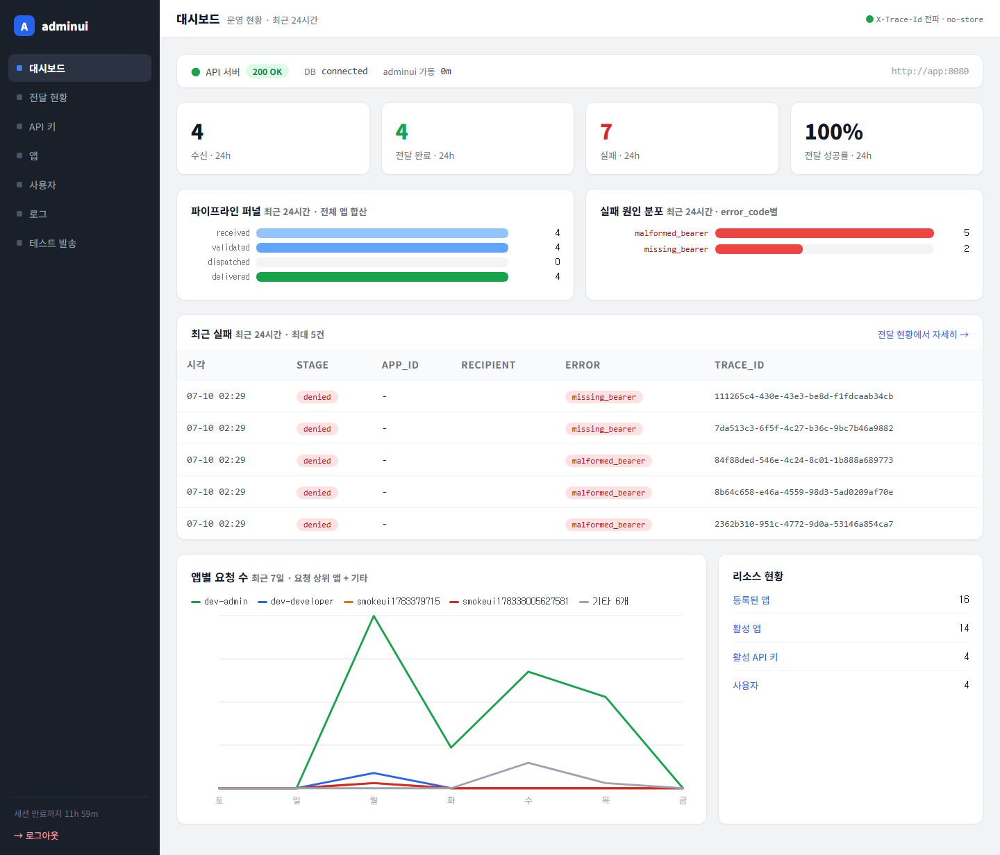
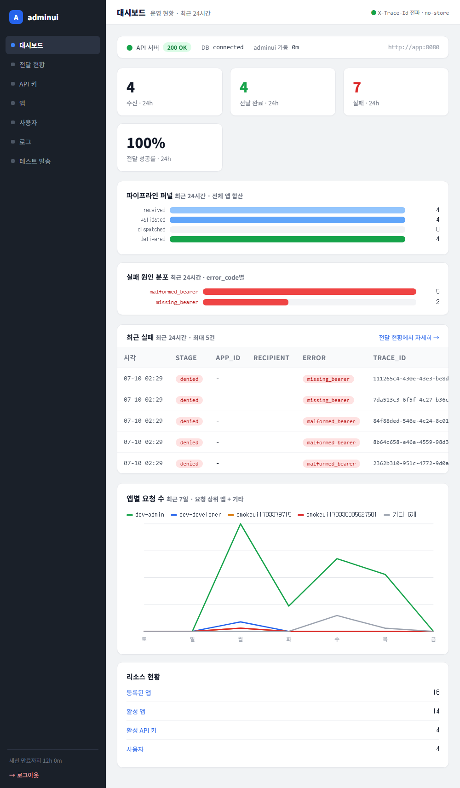

# 테스트 보고서 — 라인차트 상위 N + 기타 개선

- **날짜:** 2026-07-10
- **대상 변경:** 대시보드 "앱별 요청 수" 7일 라인차트 판독성 개선 (③)
- **범위:** `internal/adminui/dashboard.go`(`selectLineSeries` 신규 + `buildLineChart` 재작업), `dashboard_test.go`(테스트 3종), `templates/dashboard.html`(캡션).

---

## 1. 컨테이너 검증 (go build / vet / test)

```
... golang:1.26 sh -c "go build ./... && go vet ./internal/adminui/... && go test ./internal/adminui/..."
```

결과: **green** — `ok github.com/CatPope/telegram_server/internal/adminui`.

신규/영향 테스트:

| 테스트 | 커버 | 결과 |
|--------|------|------|
| `TestSelectLineSeriesShowsAllWhenFew` | 앱 ≤ topLineChartApps+1 → fold 없이 전부, 총량 desc 정렬 | PASS |
| `TestSelectLineSeriesFoldsRest` | 앱 6개 → 상위 4 + "기타 2개", 잔여 일별 합산 정확 | PASS |
| `TestBuildLineChartFoldRendersMutedRestLine` | 범례 5개, 기타 색=restLineColor, app id가 SVG raw 미노출 | PASS |
| 기존 `TestBuildLineChart*` 5종 | 회귀 없음(빈 시리즈/윈도 밖/단일 앱/단일 날/정렬) | PASS |

## 2. 시각 검증 (Playwright) — 스크린샷 첨부

adminui 이미지 재빌드 후 촬영. 라이브 데이터에 앱 10개가 있어 fold가 실제로 트리거됨.

### 1440px

*범례가 이전 10개 2줄 크램 → **5개**(dev-admin·dev-developer·smokeui1783379715·smokeui178338005627581 + 회색 "기타 6개")로 정리. 기타 합산선이 회색으로 배경처럼 읽히며 수요일 bump까지 보임. 캡션 "최근 7일 · 요청 상위 앱 + 기타".*

### 1000px

*최소폭에서도 범례 5개가 한 줄에 들어가고 차트 full-width 렌더, 깨짐 없음.*

## 3. 데이터 조건

- `RequestSeries`(7일, stage='received', app_id NOT NULL) 라이브 집계. 앱 10개 → 상위 4 개별 + 기타 6개 합산. 별도 시드/쿼리 변경 없음(상위 N 선별은 Go 인메모리).

## 4. 결과 / 미결

- **결과: green.** 컨테이너 검증 PASS, 2폭 시각 검증 깨짐 없음.
- 설계 노트: 상위 개수 `topLineChartApps=4`(팔레트 6색 내), 기타선은 muted gray(`#9ca3af`). maxCount는 **집계 후** 그려지는 선 기준으로 계산(기타선이 단일 앱보다 클 수 있어 y축 오버플로 방지).
- 후속: ④ 전달 지연 p50/p95.
