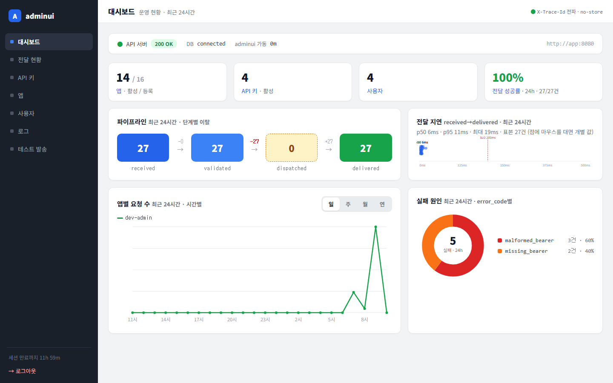
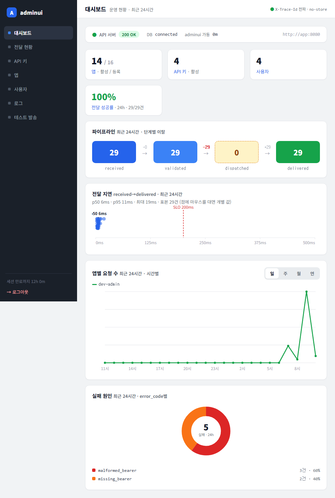
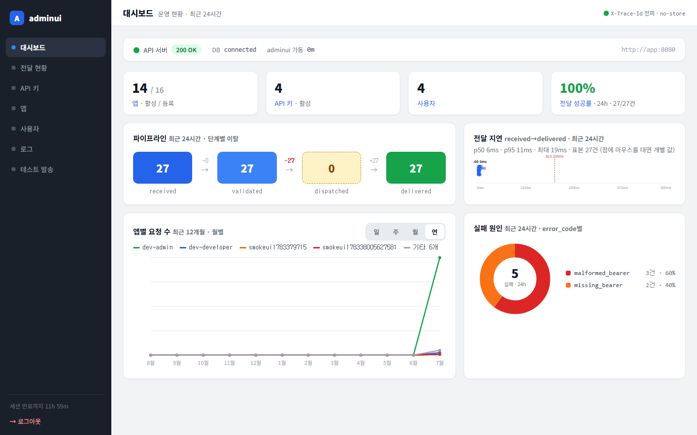
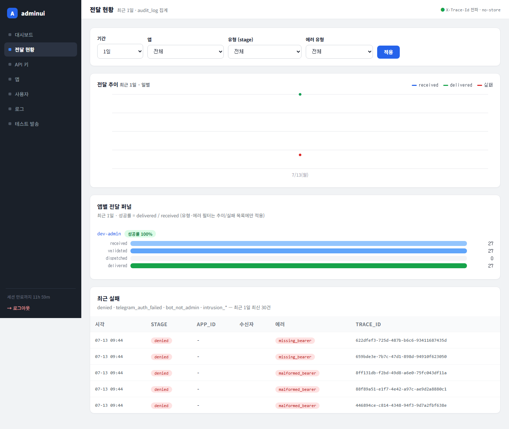
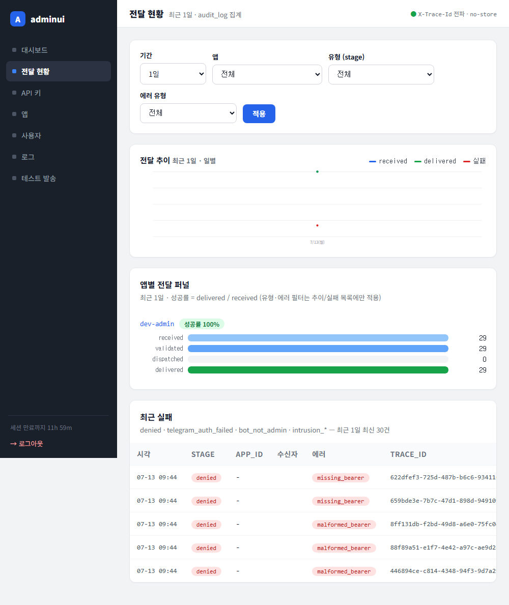
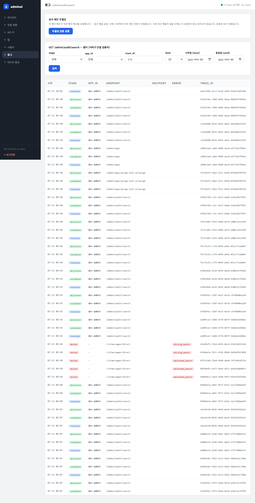
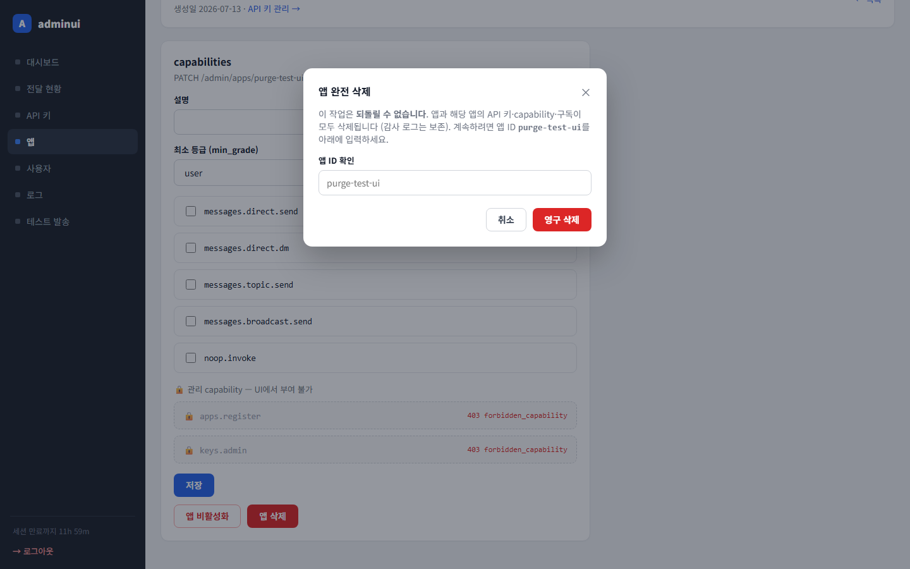
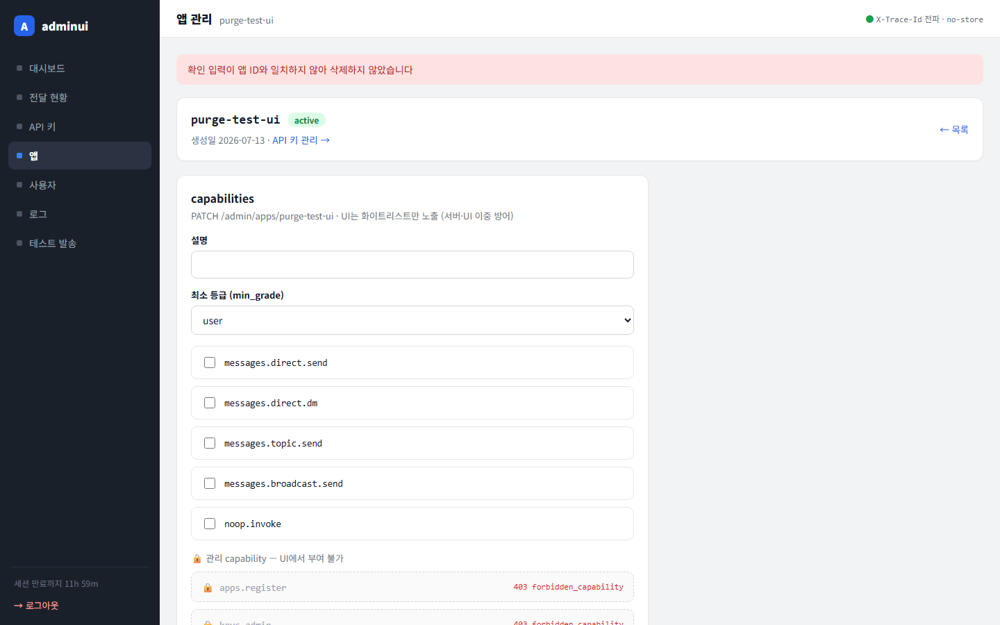
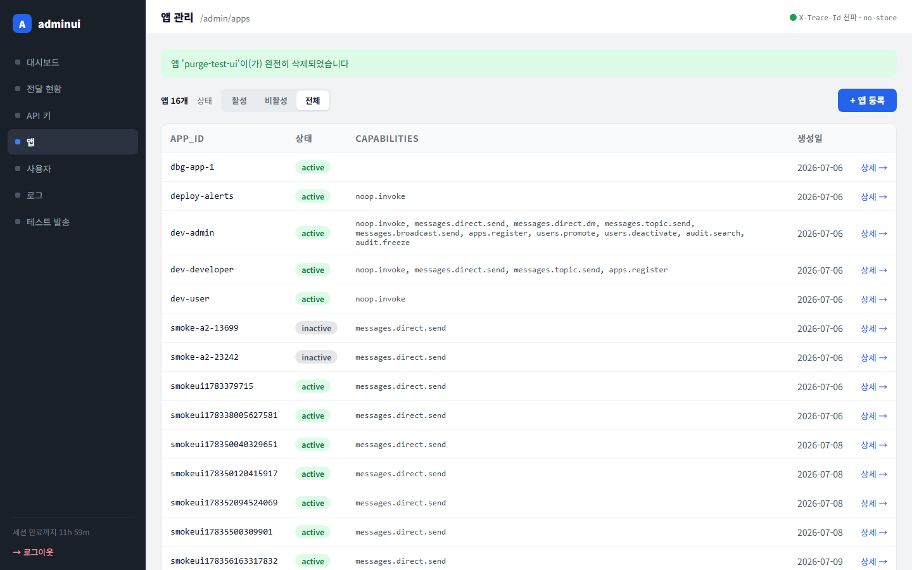

# 테스트 보고서 — adminui 요청사항 일괄 반영 (대시보드 재구성 · 전달현황 필터 · 앱 삭제 · 로그 필터 UI)

- **날짜:** 2026-07-13
- **대상 변경:** 워킹트리 (docs/planning/요청사항 반영, 커밋 직전 검증)
- **범위:** `internal/adminui` (store 쿼리 6종·대시보드/전달현황/로그/앱상세 재구성·base.html CSS), `internal/api` (`DELETE /admin/apps/{id}/purge` 신설), `internal/adminui/apiclient` (`PurgeApp`)

## 요청사항 → 구현 매핑

| 요청 | 구현 |
|---|---|
| 사이드바 길이 항상 일정 | `position:sticky; height:100vh` — 내용 길이와 무관하게 뷰포트 높이 고정 |
| 대시보드 무스크롤 | 상태 스트립 + 메트릭 4카드 + 2×2 그리드, 1440×900 뷰포트 내 완결 |
| 메트릭 카드 앱/API/사용자/성공률 | 앱(활성/등록) · API 키(활성) · 사용자 수 · 전달 성공률(24h) |
| 파이프라인 퍼널→파이프라인 형태 | 단계 박스 + 화살표 위 단계별 이탈(-N, 손실 시 적색) |
| 전달 지연 스트립 플롯 | 트레이스별 점 + p50 마커 + SLO 200ms 기준선, 점 호버 시 개별 값 |
| 앱별 요청수 일/주/월/연 + 호버 수치 | `?range=` 토글(시간별/일별/일별/월별 버킷), SVG `<title>` 네이티브 툴팁 |
| 실패원인 파이차트 | stroke-dasharray 도넛 + 범례(건수·비율), 5종 초과 "기타 N종" 폴드 |
| 최근 실패 제거 | 대시보드에서 삭제(전달 현황으로 이동 동선 유지) |
| 전달현황 기간 드롭다운 | 1일(기본)/7일/1개월/3개월/6개월/1년, 레거시 `?window=24h` 매핑 유지 |
| 앱/유형/에러 필터 + 시각화 | 앱·stage·error_code 드롭다운, 필터 적용 일별 추이 차트 |
| 앱 삭제(재확인) | `DELETE /admin/apps/{id}/purge`(하드 삭제, CASCADE) + 앱 ID 재입력 모달, 불일치 시 거부 |
| 로그 app_id/limit 드롭다운, 날짜 피커 | app_id·limit(50/100/200/500) 드롭다운, since/until `input type=date` → RFC3339 변환(until=익일 자정) |

## 1. 자동 검증 (컨테이너 golang:1.26)

`go build ./... && go vet ./internal/adminui/... ./internal/api/... && go test ./internal/adminui/... ./internal/api/handlers/...`

```
ok  github.com/CatPope/telegram_server/internal/adminui           0.860s
ok  github.com/CatPope/telegram_server/internal/adminui/apiclient
ok  github.com/CatPope/telegram_server/internal/api/handlers
```

- 신규/재작성 유닛: `buildPipelineFlow`(Drop -N/+N/DropAlert), `buildFailurePie`(폴드 경계·이스케이프·dasharray), `buildLatencyStrip`(SLO 축·p50·점별 title), `buildLineChart`(hour/month 버킷·툴팁·div-zero), `buildTrendChart`(실패 합산·stage 단일 시리즈·서클 캡), `resolveDeliveryWindow`(레거시 매핑), `auditDateToRFC3339`/`normalizeAuditDate`, Purge 핸들러/PurgeApp 클라이언트. 렌더·degrade(에러→배너/빈→명시 문구) 3분기 전 섹션 커버. 전부 PASS.
- 분리 리뷰(oh-my-claudecode:code-reviewer, Fable): Critical 0 · Major 1 · Minor 6 → **Major(요청수 차트 쿼리 실패가 "데이터 없음"으로 위장) 수정 완료**(`ChartErr` 3분기 + 회귀 테스트), Minor 중 4건 반영(성공률 카드 독립 열화, 스트립 캡션 "최신 N건 표시", until 익일 자정 경계, 레거시 RFC3339 date 에코). 잔여 2건은 후속(아래 미결).

## 2. 시각 검증 — Playwright 실측

adminui 이미지 재빌드 후 1440/1200/1000px 촬영, 실데이터(정상 30건 + denied 5건) 상태.


*스크롤 없이 한 화면 완결 확인 — 메트릭 4카드, 파이프라인 박스(-0/-30/+30 이탈 표기), 스트립 플롯(SLO 200ms 기준선·p50 마커), 시간별 라인차트(일 토글 on), 실패원인 도넛+범례.*


*fullPage에서도 추가 콘텐츠 없음(무스크롤 그대로).*


*1100px 분기점 아래 단일 열 접힘 — 카드 붕괴·오버플로 없음, 도넛 크기 고정 유지.*


*연(12개월 월별) 토글 — 상위 4앱 + 기타 폴드 범례, 월 라벨(8월~7월).*


*기간 드롭다운(1일 기본) + 앱/유형/에러 필터 + 적용 버튼, 필터 적용 추이 차트(received/delivered/실패), 퍼널·최근 실패 정상.*


*필터 폼 2행 랩, 테이블 헤더 nowrap(수신자 세로 꺾임 수정 확인), 카드 내 가로 스크롤 동작.*


*app_id·stage·limit 드롭다운 + since/until 날짜 피커(브라우저 네이티브) 렌더 확인.*


*CSS :target 모달 — 경고 문구, 앱 ID 재입력 필드, 취소/영구 삭제.*


*confirm_id 불일치 → "삭제하지 않았습니다" 배너, 앱 유지.*


*정확한 ID 입력 → 목록으로 리다이렉트 + 삭제 배너, 목록에서 앱 제거 확인.*

### E2E (Playwright)

- 앱 삭제 흐름: UI로 `purge-test-ui` 생성 → 모달 오입력 거부 확인 → 정입력 삭제 → 배너·목록 부재 확인 (`purge-e2e.mjs` — created/rejected/purged/absent 전부 PASS).
- 하드 삭제 후 감사 체인 무결성: UI 검증 버튼 → **✓ 체인 정상 — 425행 검증됨** (audit_log에 FK 없음 → purge가 체인을 단절하지 않음을 실측).

## 3. 데이터/환경 조건

- 로컬 compose 스택(app→18080 오버라이드, adminui 8081, postgres 5433). 카드 데이터는 실제 API 트래픽으로 생성(정상 전달 + 무효/누락 베어러 `POST /v1/messages/direct` → denied·malformed_bearer/missing_bearer). raw INSERT 미사용(감사 체인 보존).
- 호스트에 Go 없음 → 빌드/테스트는 golang:1.26 컨테이너.

## 4. 결과 / 미결

- **결과: green.** 요청사항 12항목 전부 구현·실측 확인, 자동 검증 전부 통과, 리뷰 Major 해소.
- 미결(후속 후보): ① `/apps?purged=` 배너가 URL로 위조 가능(기존 `?saved=` 패턴과 동급, XSS 아님 — 플래시 쿠키 전환 검토), ② purge가 소프트 삭제와 동일 capability(`apps.register`) 게이트 — 별도 `apps.purge` 도입 검토.
