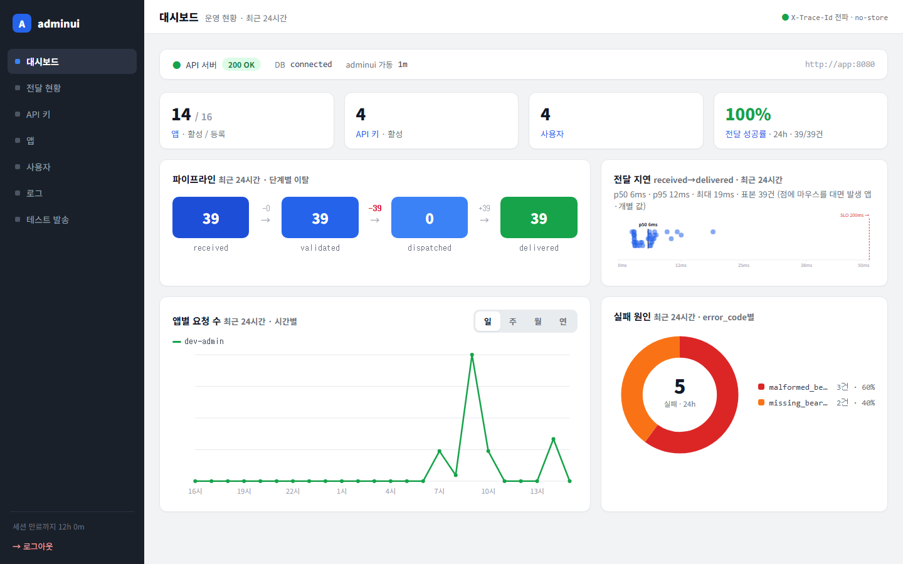
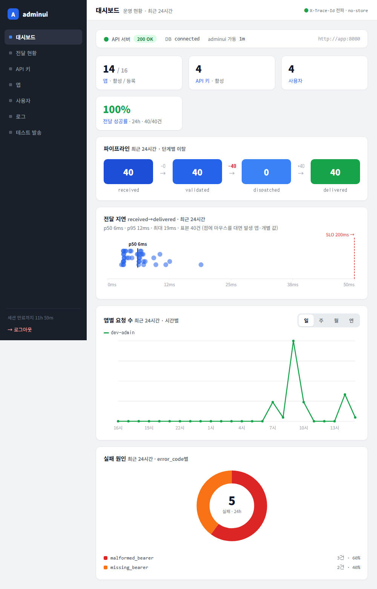
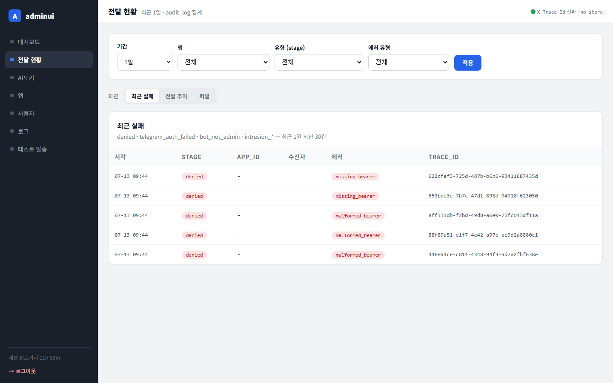
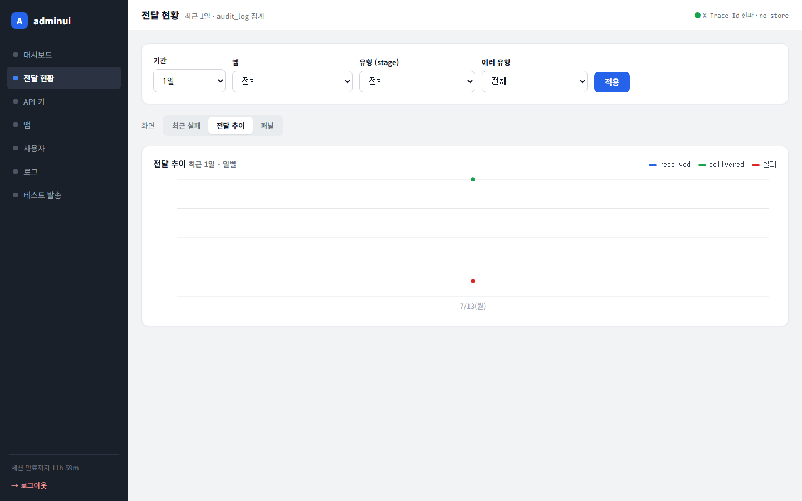
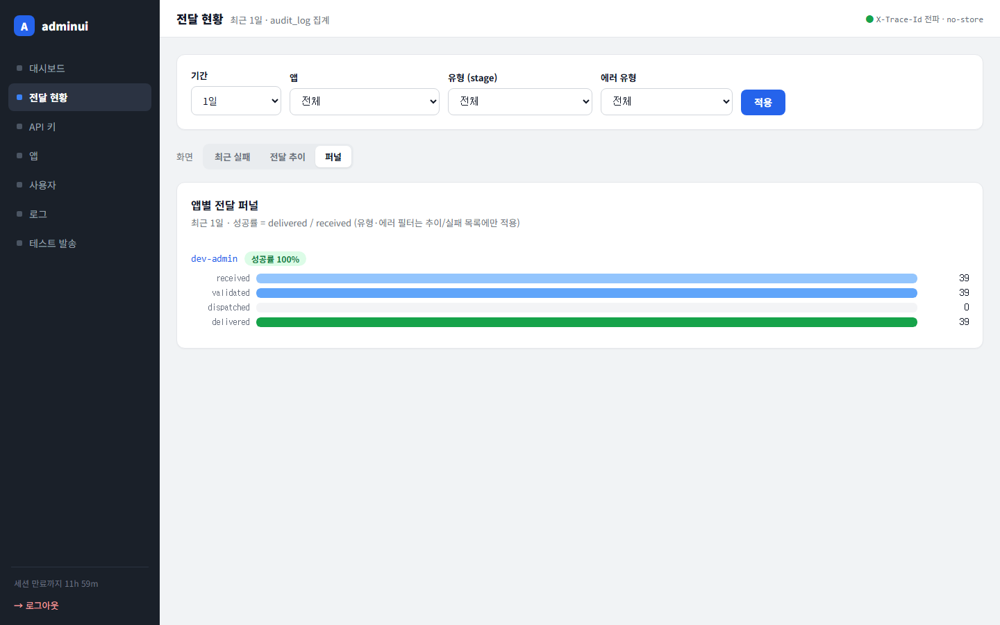
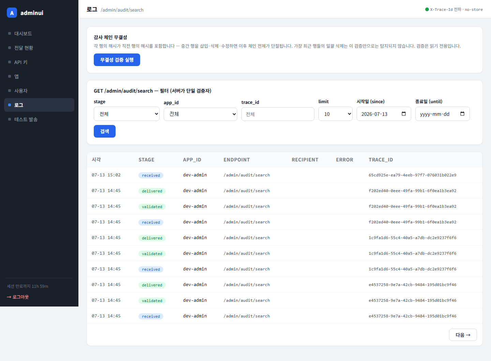
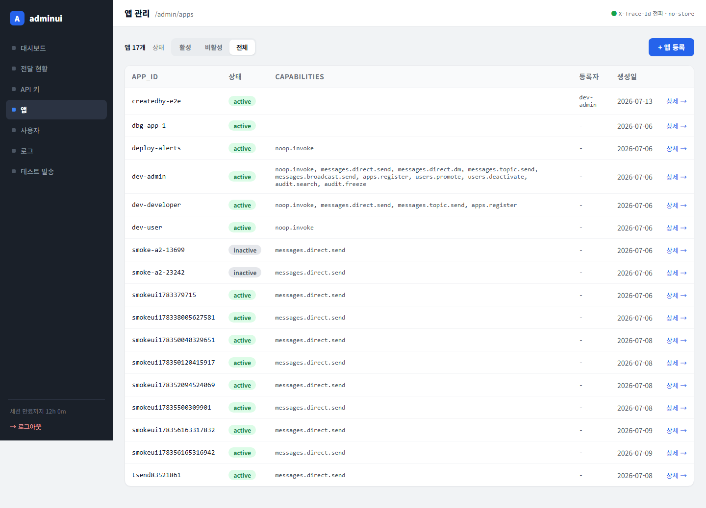

# 테스트 보고서 — adminui R2 (그래프 직관화 · 화면 분리 토글 · 등록자 · 로그 페이지네이션)

- **날짜:** 2026-07-14
- **대상 변경:** 워킹트리 (요청사항 R2 반영, 커밋 직전 검증)
- **범위:** `migrations/0008`, `internal/api/handlers`(created_by·before_id), `internal/adminui/apiclient`, `internal/adminui`(dashboard/delivery/audit/apps + 템플릿)

## 요청사항 → 구현 매핑

| 요청 | 구현 |
|---|---|
| 전달지연·앱별 요청수 호버에 발생 앱+수치 | 지연 표본 쿼리가 delivered 행의 app_id 동반(DISTINCT ON) → 점 툴팁 "app · 6ms" (요청수 차트는 기존부터 앱 포함) |
| 실패원인 호버 수치 | 도넛 슬라이스 `<title>` "code · N건 (P%)" (기존 유지 확인) |
| 실패원인 원 확대 + 0건 초록 | SVG 220/r80/sw36, 폭 170→210px. 0건이면 초록 링+"0" 정적 SVG(쿼리 에러는 기존 경고 배너 — 3분기 유지) |
| 전달 지연 직관화 | 축을 데이터 기준으로(niceAxisMax(max×1.3)) — 6ms 표본이 50ms 축에 퍼져 보임. SLO 200ms가 축 밖이면 오른쪽 끝 고정+"SLO 200ms →" 수치 표기, 축 안이면 실위치. SVG 확대(h150, 점 r6) |
| 전달현황 화면 분리 토글 | `?view=` failures(기본)/trend/funnel, .seg 그룹(키 화면 스타일), 필터 보존, view별 필요한 쿼리만 실행 |
| 앱 등록자 컬럼 | migration 0008 `apps.created_by` + Create 시 요청자 app id 기록, 목록 컬럼(기존 행 '-') |
| 로그: 당일 기본 | 무쿼리 진입 시 since=당일(UTC)+limit 10 (명시적 빈 검색은 존중) |
| 로그: limit 10/20/30/50 | 드롭다운 교체, UI 기본 10 |
| 로그: 페이지 나누기 | `/admin/audit/search`에 before_id 키셋(id DESC), limit+1 fetch로 다음 페이지 판정, "다음 →"(마지막 행 id 커서)/"« 처음" — 필터 보존 |
| (공통) 1년 후 데이터 삭제 | **미구현 (사용자 결정)** — 감사 해시 체인이 genesis 앵커라 오래된 행 삭제 시 무결성 검증이 깨짐. "무결성이 깨지면 안 된다" 확인받아 제외 |

## 1. 자동 검증 (컨테이너 golang:1.26)

`go build ./... && go vet ./internal/... && go test ./internal/...` → **전 패키지 PASS**.

- 신규/갱신 테스트: 스트립(축 데이터 기준·SLO 우측 고정/실위치·앱 툴팁 이스케이프), 파이 0건 초록 링 분기, 전달현황 view 라우팅(기본 failures·가비지 폴백·view별 단독 쿼리·토글 필터 보존·화면별 degrade 배너), 로그(당일 기본·명시적 빈 검색 존중·limit+1 프로브·다음/처음 링크 쿼리 정확성·before_id 전달), apiclient BeforeID 전달·ID 파싱.
- 마이그레이션 0008 적용 확인: `information_schema.columns`에 `apps.created_by` 존재.

## 2. 시각 검증 — Playwright 실측 (1440/1000px)

*스트립 축이 데이터 기준 50ms로 확대되어 표본(6~19ms)이 분산 판독 가능, SLO 200ms는 오른쪽 끝 적색 점선+수치, 캡션 "점에 마우스를 대면 발생 앱·개별 값". 파이 확대. 무스크롤 유지.*

*단일 열 접힘 정상, 확대된 파이·스트립 붕괴 없음.*

*화면 토글(최근 실패·전달 추이·퍼널) 기본 선택 = 최근 실패, 해당 카드만 렌더.*

*추이 화면 단독 렌더, 토글 선택 상태 정확.*

*퍼널 화면 단독 렌더.*

*당일(since=2026-07-13 UTC) 기본, limit 10 선택, 정확히 10행 + "다음 →".*

*`?before_id=459&limit=10&since=…` 커서 이동 — 행 연속(중복 없음), "« 처음"과 "다음 →" 동시 표시.*

*UI로 생성한 앱의 등록자=dev-admin(adminui의 API 키 주체), 기존 앱은 '-'.*

### E2E

- 로그 페이지네이션: 1페이지 "다음 →" 클릭 → `before_id=459` 커서 URL, 2페이지에 "« 처음" 존재 — PASS.
- 등록자: 앱 생성(`createdby-e2e`) → 목록에 dev-admin 표기 확인 → purge 정리 — PASS.

## 3. 데이터/환경 조건

- 로컬 compose 스택(app→18080), migrate 서비스로 0008 자동 적용. 실데이터(당일 audit_log 460여 행) 기준.

## 4. 결과 / 미결

- **결과: green.** R2 요청 9항목 구현·실측 확인(1항목은 사용자 결정으로 제외), 전 패키지 테스트 통과.
- 유의: 로그 정렬이 at DESC→id DESC로 변경(BIGSERIAL 삽입순, 실질 동일) — adminui와 백엔드가 같이 배포되어야 함. 대시보드의 /delivery 링크는 이제 기본 view(최근 실패)에 착지.
